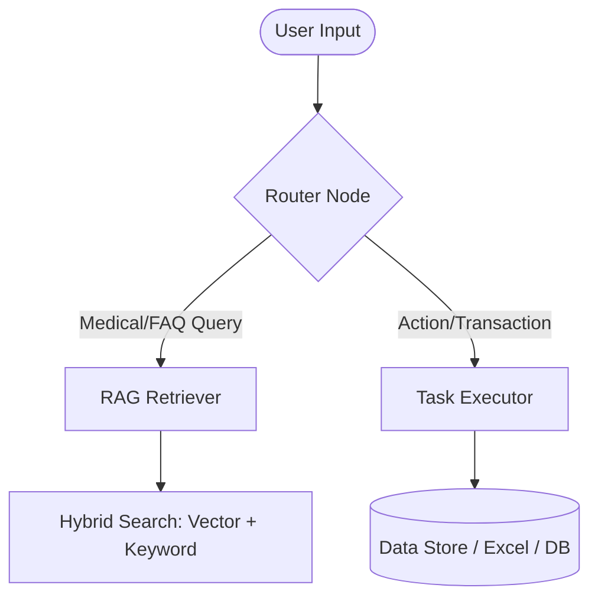

# Best Practices in RAG and Agent Base Structures for Small Businesses

Based on industry research, small businesses implementing Retrieval-Augmented Generation (RAG) and Agentic structures should prioritize **simplicity, cost-efficiency, and modularity** to maximize ROI and avoid operational overhead.

---

## 1. Core Architecture Strategy: "Keep It Modular"

Instead of building massive, complex systems, small businesses benefit from a **Modular Agentic RAG** architecture:

### Key Practices
*   **Use Hybrid Search**: Combine semantic search (vector database) with keyword search (BM25). Vector search captures intent and concepts, while keyword search ensures specific items like product IDs, legal names, or model SKUs are accurately matched.
*   **Stateful Agentic Workflows (e.g., LangGraph)**: Use graph-based frameworks to represent user state and node transitions. This makes it easy to trace actions, repeat steps when information is missing, and transition between informational (RAG) and transactional (booking/APIs) states.
*   **Simple Local Databases**: Start with lightweight, file-based, or open-source vector databases (such as FAISS or ChromaDB) and standard spreadsheets (like Excel) or SQLite to avoid expensive enterprise cloud licensing early on.

---

## 2. Ingestion & Quality Control

A RAG model is only as good as the data fed into it.

*   **Avoid Naive Chunking**: Avoid blindly splitting text every 1,000 characters. Instead, chunk documents logically by section headers, paragraphs, or semantic boundaries to maintain context.
*   **Structured Metadata**: Tag chunks with source attributes (e.g., `file_name`, `page_number`, `category`, `last_updated_at`). This enables the retriever to filter results based on specific dates or categories and cite sources in answers.
*   **Regular Refreshes**: Establish a simple, automated folder listener or cron job to run ingestion whenever documents are added, modified, or deleted in the base folder.

---

## 3. Cost-Efficiency & Resource Optimization

*   **Cost-Effective Embedding Models**: Use lightweight embedding models (e.g., `sentence-transformers/all-MiniLM-L6-v2` locally or OpenAI's `text-embedding-3-small` via API) which are cheap or free and provide excellent performance for small knowledge bases.
*   **Serverless or Local LLM Providers**: Use low-latency, pay-as-you-go serverless inference providers like **Groq** (using Llama-3 models) to get high-speed agentic execution without the high costs of self-hosting or heavier proprietary models.
*   **Deterministic Fallbacks**: Don't let LLMs decide everything. Implement hard-coded keyword routing for common, predictable intents (like greeting, booking, or catalog lookup) to save tokens and improve speed.

---

## 4. Observability and Iteration

*   **Build a Golden Dataset**: Create a simple list of 20-50 typical user questions paired with correct target answers. Test your agent against this set after every change to prevent regressions.
*   **Trace Agent Logic**: Use debugging logs or dashboard tools (e.g., LangSmith) to inspect which chunks were retrieved, what prompts were generated, and how many tokens were used.
